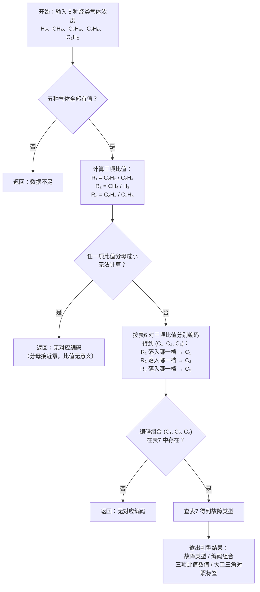

# 三比值法流程图

> 依据：DL/T 722-2014 §10.2 表6（编码规则）+ 表7（故障类型判断）。

---

## 表6　三比值法编码规则

| 气体比值 | 范围 | 编码 |
|---------|------|:---:|
| C₂H₂/C₂H₄ | < 0.1 | 0 |
| | 0.1 ~ 3 | 1 |
| | ≥ 3 | 2 |
| CH₄/H₂ | < 0.1 | 1 |
| | 0.1 ~ 1 | 0 |
| | ≥ 1 | 2 |
| C₂H₄/C₂H₆ | < 1 | 0 |
| | 1 ~ 3 | 1 |
| | ≥ 3 | 2 |

---

## 表7　故障类型判断方法（编码组合 → 故障类型）

| 编码组合 (C₂H₂/C₂H₄, CH₄/H₂, C₂H₄/C₂H₆) | 故障类型 |
|:---:|---------|
| 0,0,0 | 低温过热 < 150℃ |
| 0,2,0 | 低温过热 150～300℃ |
| 0,2,1 | 中温过热 300～700℃ |
| 0,0,2 / 0,1,2 / 0,2,2 | 高温过热 > 700℃ |
| 0,1,0 | 局部放电 |
| 2,0,0 / 2,0,1 / 2,0,2 | 低能放电 |
| 2,1,0 / 2,1,1 / 2,1,2 | 低能放电 |
| 2,2,0 / 2,2,1 / 2,2,2 | 低能放电兼过热 |
| 1,0,0 / 1,0,1 / 1,0,2 | 电弧放电 |
| 1,1,0 / 1,1,1 / 1,1,2 | 电弧放电 |
| 1,2,0 / 1,2,1 / 1,2,2 | 电弧放电兼过热 |

---

## 算法流程图

---

## 关键实现说明

- **浓度下限**：代码中设有经验下限（H₂、CH₄、C₂H₄、C₂H₆ < 10 μL/L，C₂H₂ < 1 μL/L），全低于下限则判数据不足。此阈值属工程经验取值，国标未给出单气体比值下限明文。

  **为什么两个值不统一（10 vs 1）？**

  三比值法的核心是计算气体浓度之间的**比值**（如 C₂H₄/C₂H₆），比值的有效性取决于分子分母是否处于可信量级。传感器测量精度通常在 ±几个 μL/L 量级，若气体浓度本身只有几个 μL/L，测量误差可能与信号值相当，导致比值结果完全不稳定，编码可能落错区间，给出错误故障类型。

  - **H₂、CH₄、C₂H₄、C₂H₆ 取 10 μL/L**：这四种气体在正常运行变压器中背景浓度通常在数十 μL/L 量级（H₂ 注意值 150 μL/L、总烃注意值 150 μL/L），10 μL/L 以下意味着信噪比极差，比值计算不可信。
  - **C₂H₂（乙炔）取 1 μL/L**：乙炔是高能放电的特征气体，正常运行变压器中背景浓度极低，DL/T 722—2014 注意值仅为 5 μL/L。若也取 10 μL/L，则浓度已在注意值量级（如 3～8 μL/L）的放电样本会被误判为数据不足，**漏掉真实放电信号**。因此乙炔单独取 1 μL/L 作为最低可信浓度，兼顾低背景与信号灵敏性。

  **修改此值时的注意事项**：两个下限不应随意统一，需分别结合各气体的物理背景浓度和标准注意值来评估。
- **分母为零保护**：任一分母过小（接近零）时比值记为无效，输出「无对应编码」。
- **编码非单调**：CH₄/H₂ 编码为三段（<0.1→1, 0.1~1→0, ≥1→2），并非单调递增，直接对照表6 即可。
- **大卫三角对照**：表7 结果按工程映射表转为大卫三角分区代码（PD/D1/D2/T1/T2/T3/DT），供交叉研判一致性对比，非国标官方映射。