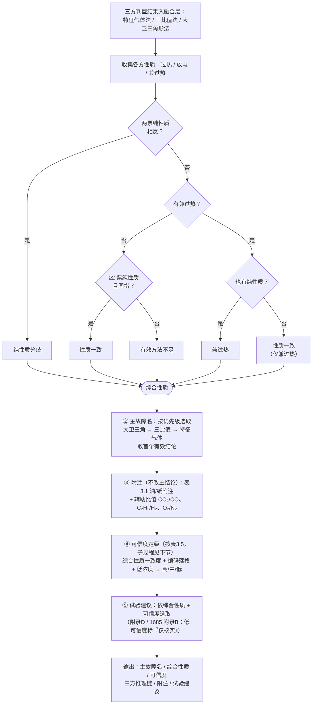
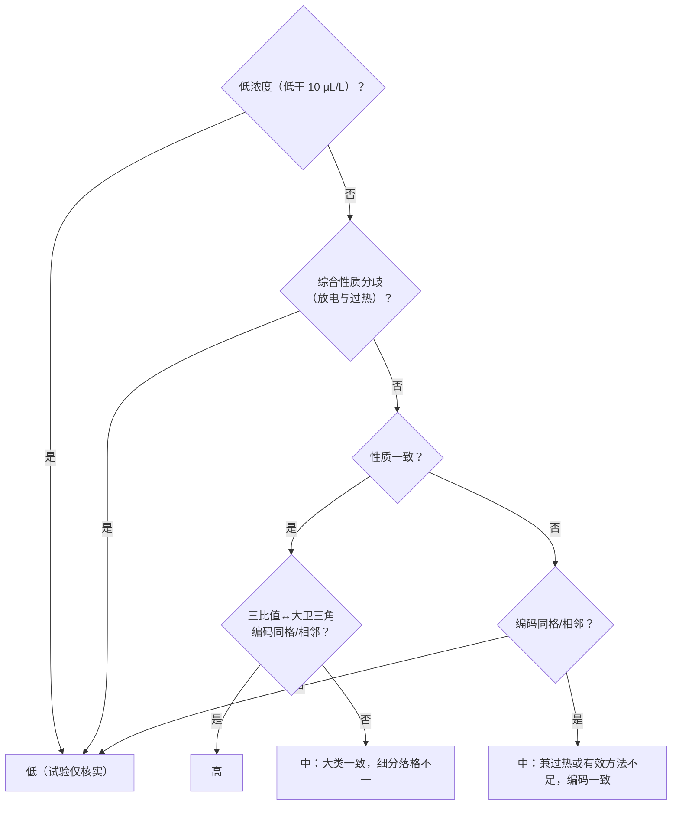

# 多规则协同判断与可信度标注方法

> 依据：DL/T 722-2014 §10.2（三比值法）、§10.1 表5（特征气体法）、附录C（大卫三角形法）。融合策略为工程实现，国标未作规定。

---

## 方法协同框架

三种判型方法独立运行后，进入交叉研判环节。融合层接收三种方法各自的输出，依次完成以下四个任务：

1. **性质大类一致性判断**：比较三方给出的故障性质（过热/放电），投票决定综合性质。
2. **主结论优先级选取**：按大卫三角法 → 三比值法 → 特征气体法的优先级确定主故障名称。
3. **可信度定级**：依据三方一致程度、低浓度标记、编码落格一致性，将可信度分为高、中、低三档。
4. **补充信息附加**：特征气体法的油/纸维度以附注形式补充；§10.2.3 辅助比值作为参考信息附入。

---

## 算法流程图

> 主干 = **三方判型 → 融合出一个综合结论**（综合性质 + 主故障名 + 附注），可信度只是给这结论贴的一个标签，故收为主干上的一个子过程（见虚线框，展开见下节）。

### 子过程④：可信度定级（按表3.5 依次匹配，先命中先生效）

---

## 可信度定级规则

分档主轴 = **性质大类（放电/过热）**，它决定试验方向、最稳；三比值↔大卫三角的编码落格只是同一大类内的细分（温区/能级），权重更低。

| 可信度 | 条件 | 说明 |
|:---:|------|------|
| 高 | 性质投票为一致，且三比值与大卫三角编码同格/相邻 | 三方强吻合 |
| 中 | ① 大类一致但编码落格不一（如 T1 vs T3，同过热不同温区）；或 ② 含兼过热、或仅一方给出有效纯性质，但编码同格/相邻 | 大类可信、细分待核实 |
| 低 | 低浓度；或纯放电与纯过热分歧；或含兼过热或有效方法不足，且编码落格不一 | 暂定结论，试验仅用于核实 |

---

## 主结论优先级

当三种方法给出不同故障名称时，按下述优先级选取主结论：

1. **大卫三角形法**（优先）：输出分区标签（PD / D1 / D2 / T1 / T2 / T3 / DT）对应的故障名称。
2. **三比值法**（次选）：输出表7 编码组合对应的故障名称，同步映射到大卫三角分区标签供一致性对比。
3. **特征气体法**（末选）：仅在前两种方法均未得出有效结论时使用，不映射为分区标签。

---

## 三比值与大卫三角编码相邻关系

| 分区标签 | 视为一致的相邻代码 |
|:---:|---------|
| PD | D1 |
| D1 | PD、D2、DT |
| D2 | D1、DT、T3 |
| T1 | T2、DT |
| T2 | T1、T3、DT |
| T3 | T2、D2、DT |
| DT | D1、D2、T1、T2、T3 |

> 两方法编码相同或位于上表相邻关系内，视为编码一致。

---

## 补充信息说明

- **油/纸附注**：特征气体法命中油和纸类故障时，若性质大类不打架，则在结论中附加「表5 提示可能涉及固体绝缘（油+纸）」；若仅涉及油而不涉纸则不加注。
- **辅助比值**：CO₂/CO（判断固体绝缘涉入程度）、C₂H₂/H₂（判断有载分接开关油污染）、O₂/N₂（判断密封状况）作为辅助信息附入推理链，不改变主结论。
- **试验建议**：依据故障性质和可信度，从 DL/T 722-2014 附录D 和 DL/T 1685-2017 附录B 中选取推荐的进一步试验项目。低可信度时试验建议标注为「仅核实」。