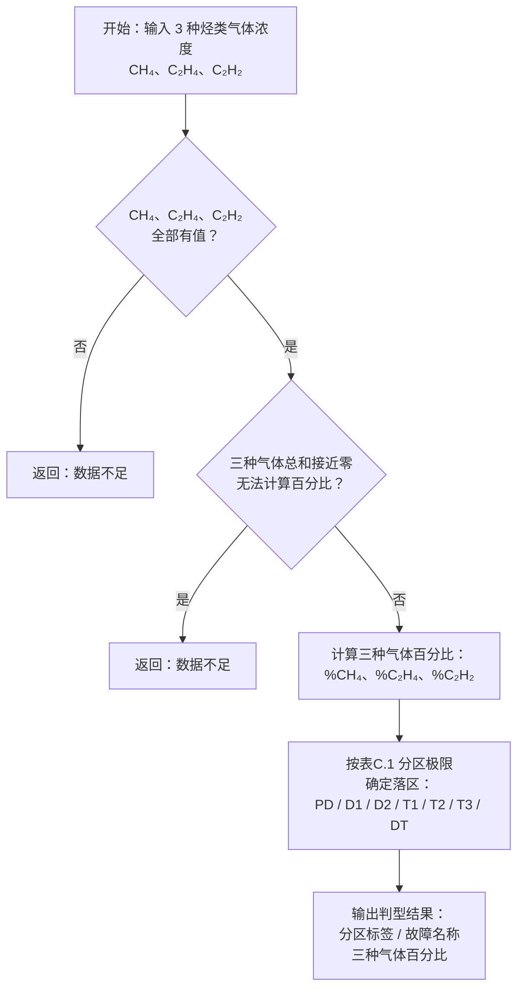

# 大卫三角形法流程图

> 依据：DL/T 722-2014 附录C 图C.2 / 表C.1。仅使用 Duval Triangle 1（三气体百分比），不使用立体图示法。

---

## 表C.1　分区极限

| 分区 | 故障类型 | 极限线 |
|:----:|---------|--------|
| PD | 局部放电 | CH₄ ≥ 98% |
| D1 | 低能放电 | C₂H₄ < 23%，C₂H₂ ≥ 13% |
| D2 | 高能放电 | C₂H₄ ≤ 38% 或 C₂H₂ ≥ 29%，且 C₂H₄ ≥ 23%，C₂H₂ ≥ 13% |
| T1 | 热故障 < 300℃ | C₂H₂ < 4%，C₂H₄ < 10% |
| T2 | 热故障 300～700℃ | C₂H₂ < 4%，C₂H₄ 10%～50% |
| T3 | 热故障 > 700℃ | C₂H₄ ≥ 50%，C₂H₂ < 15% |
| DT | 放电兼过热 | D2 / T2 / T3 极限线围成的中间区域 |

> 分界线上点的归属规则：落在边界线上的点归入两相邻区域中故障更严重的一侧，严重度序为 D2 > D1 > D+T > T3 > T2 > T1。唯一例外：CH₄ = 98% 线按行业习惯归入 PD 区（含线）。

---

## 算法流程图

---

## 分区判别逻辑说明

整个判别过程是排除式的多级分支：

1. 先判断最顶部的 **PD** 区（CH₄ ≥ 98%），该区独立于其他所有区域。
2. 再按 C₂H₂ 含量将三角图分成三大带：
   - **C₂H₂ < 4%**（底部纯热区）：按 C₂H₄ 高低分出 T1 → T2 → T3。
   - **C₂H₂ ≥ 13%**（顶部放电区）：按 C₂H₄ 高低分出 D1 → D2，右上折块归 DT。
   - **4% ≤ C₂H₂ < 13%**（中间过渡带）：除 T3 高 C₂H₄ 特例外，全部归 DT。
3. 边界点归属遵循「归更严重一侧」原则，确保判定结果保守。

> 仅使用 CH₄、C₂H₄、C₂H₂ 三种气体，不涉及 H₂、C₂H₆。因为大卫三角形法仅依据三种烃类的相对百分比判断故障类型。