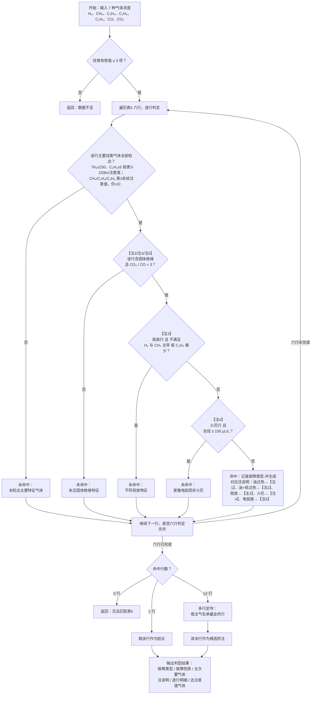

# 特征气体法流程图

> 依据：DL/T 722-2014 §10.1 表5。以下 Mermaid 代码可复制到 mermaid.live 或 Word Mermaid 插件生成矢量图。

---

## 表5　故障类型对照表

| 序号 | 故障类型           | 主要特征气体       | 次要特征气体     | 固体绝缘 | 故障性质 |
| :--: | ------------------ | ------------------ | ---------------- | :------: | :------: |
|  1   | 油过热             | CH₄、C₂H₄          | H₂、C₂H₆         |    否    |   过热   |
|  2   | 油和纸过热         | CH₄、C₂H₄、CO      | H₂、C₂H₆、CO₂    |    是    |   过热   |
|  3   | 油纸绝缘中局部放电 | H₂、CH₄、CO        | C₂H₄、C₂H₆、C₂H₂ |    是    |   放电   |
|  4   | 油中火花放电       | H₂、C₂H₂           | —                |    否    |   放电   |
|  5   | 油中电弧           | H₂、C₂H₂、C₂H₄     | CH₄、C₂H₆        |    否    |   放电   |
|  6   | 油和纸中电弧       | H₂、C₂H₂、C₂H₄、CO | CH₄、C₂H₆、CO₂   |    是    |   放电   |

> 注：含固体绝缘时需 CO₂/CO < 3 佐证（引用 §10.2.3.1）。

---

## 算法流程图（Mermaid）

---

## 逐行判定条件说明

|   判定内容   | 适用范围                       | 判定方式                                         | 不通过原因                     |
| :----------: | ------------------------------ | ------------------------------------------------ | ------------------------------ |
| 主要烃类检出 | 全部六行                       | 该行主要特征气体（除 CO、CO₂）均检出：H₂≥150、C₂H₂≥5（表3 220kV注意值）；CH₄/C₂H₄/C₂H₆ 表3未列注意值，仍以>0 计 | 未检出主要特征气体             |
| 固体绝缘佐证 | 油和纸过热、局放、油和纸中电弧 | CO₂ / CO < 3                                     | CO₂ / CO ≥ 3，未见固体绝缘特征 |
| 局放特征约束 | 油纸绝缘中局部放电             | H₂ 和 CH₄ 均不低于其余烃类，且 C₂H₄ 为四烃中最少 | 不满足局放特征气体分布         |
| 火花特征约束 | 油中火花放电                   | 总烃 < 150 μL/L                                  | 总烃已达注意值，更符合电弧特征 |

> 判定采用排除法：每行初始假定命中，然后依次用上表四项排除条件逐条过滤。主要烃类检出为全表通用的第一道排除项，后三项各自仅对特定行生效——不满足即排除，通过则继续。局放行额外经过三道过滤，其余行最多两道。只有未被任何排除条件拦截的行，才能最终命中。
>
> 关于「检出」门槛：表5 只给定性名单、未给单气体下限。为避免极少量气体误命中（如高温过热样本里只有一丁点 C₂H₂ 就被误判为放电类），对表3 已列注意值的主气借其注意值当检出线——本项目定位 220kV 及以下，取 H₂≥150、C₂H₂≥5；表3 未列注意值的 CH₄/C₂H₄/C₂H₆ 不自造门槛，仍按检出>0。此为工程取值，非表5 原文。

---

## 多行命中定夺规则

当同一组气体同时命中多行时，取主要特征气体列表最长的一行作为最终结论，其余命中行附入注说明提示，建议结合三比值法或大卫三角形法进一步细分。

主气名单的嵌套关系决定了「最长即最具体」：

- 过热侧：油过热（2 个主气）⊂ 油和纸过热（3 个主气）
- 放电侧：油中火花放电（2 个主气）⊂ 油中电弧（3 个主气）⊂ 油和纸中电弧（4 个主气）
